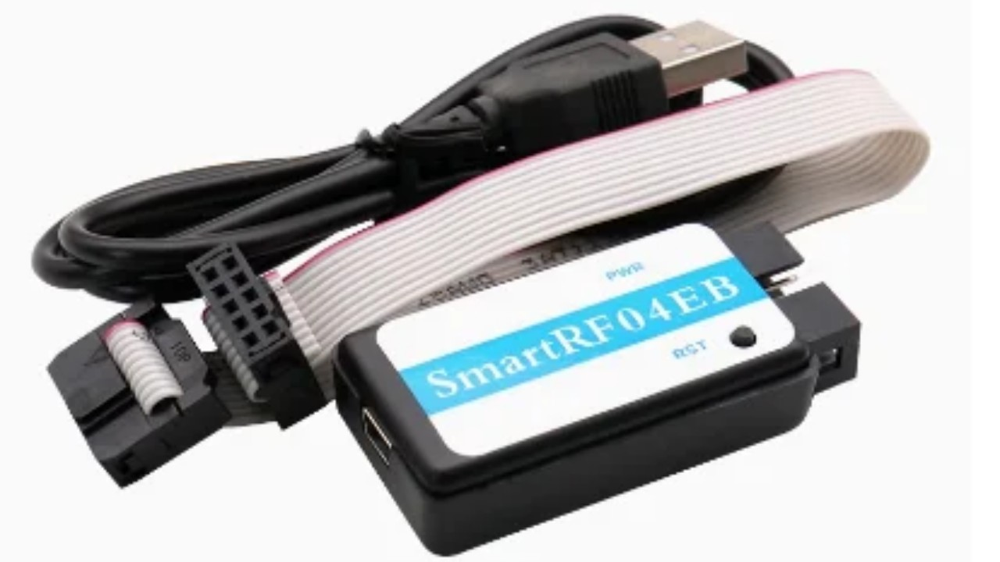

# Zigbee DIY Marketplace

| Photo | Device| Description | Cost|
| --- | --- | --- | --- |
|  | [**стик V4**](https://github.com/DIYZi/RFS_CC2652_V4/wiki) | Zigbee USB координатор CC2652P1 или CC2652P7. Прошивается через USB, не требуется программатор, при смене прошивки может работать как zigbee router для расширения покрытия сети  | 2000 |
|  | [**шилд V4**](https://teletype.in/@novgorod_diyzi/shieldV4) | Zigbee координатор для Raspberry pi v4 CC2652P1 или CC2652P7  | 2000 |
|  | [**SLS шлюз**](https://teletype.in/@novgorod_diyzi/sls) | Автономный zigbee шлюз SLS esp32-16mb+LED+CC2652P1 | 3500 |
|  | [**OpenWRT сервер**](https://openlumi.github.io/wiki/) | Мини-сервер умного дома с предустановленным [***HOMEd***](https://wiki.homed.dev/), Wifi, Zigbee, BLE на борту. Питание через USB Type-C. | 1500 |
|  | [**DEV2652**](https://github.com/deaxx/cc2652p_board) | Zigbee dev_board Deaxx (сс2652 E-byte), прошивается без программатора через порт USB Type C. Для изготовления своих DIY zigbee устройств.  | 2200 |
|  | [**DEV2530**](https://kasito.ru/universalnyj-zigbee-modul-s-batarejnym-pitaniem-na-osnove-e18-ms1-pcb/) | Zigbee Dev_board Kasito (cc2530 E-byte). Для изготовления своих DIY zigbee устройств.  | 600/1000 |
|  | [**SmartRF04EB**](https://aliexpress.ru/wholesale?SearchText=SmartRF04EB) | программатор для zigbee чипов CC2530  | 600 |
|  | [**IO8x**](https://github.com/DIYZi/RFS_CC2652_IO8X/wiki) | Zigbee 8х канальный модуль ввода/вывода  | 3000 |
|  | [**USBsw**](https://teletype.in/@novgorod_diyzi/USBswitch) | Zigbee выключатель DIY&Zi USB switch, коммутация 5V и ток до 1.5А(cc2530 E-byte)  | 1200 |
|  | [**R2x**](https://teletype.in/@novgorod_diyzi/r2xBI) | Zigbee реле 2х канальное бистабильное (cc2652 DIY), коммутируемый ток до 3A 30VDC / 1A 125VAC,  | 1600 |
|  | [**Watermeter**](https://github.com/DIYZi/ZTU_WM_V2/wiki) | Zigbee счетчик импульсов V2.2 на базе Zigbee модуля Telink TLSR8258, питание 2хАА  | 2000 |
|  | [**LEAK**](https://aliexpress.ru/wholesale?SearchText=sensor+leak+1+metr) | сенсор протечки воды 12-24В 1 метр | 100 |
|  | [**CO2/VOC**](https://github.com/DIYZi/RFS_CC2652_CO2/wiki) | Zigbee датчик CO2/VOC CC2652  | 4000 |
|  | [**DS8x**](https://github.com/DIYZi/RFS_CC2652_DS8X/wiki) | Zigbee датчик температуры 8х канальный DS18B20 CC2652  | 2200 |
|  | [**DS18B20**](https://aliexpress.ru/wholesale?SearchText=DS18B20) | сенсор температуры DS18B20  | 250/300/350 |
|  |  |  |  |

---

 **- Купить сделанные мной DIY Zigbee устройства**

 **- Купить другие DIY Zigbee устройства**

 **- Обсудить любые DIY Zigbee устройства**

> [!NOTE]
> Большая просьба, если Вы увидели ошибку или неточность в этом описании, сообщите [***мне***](https://t.me/Novgorod_DIYZi) о ней!
